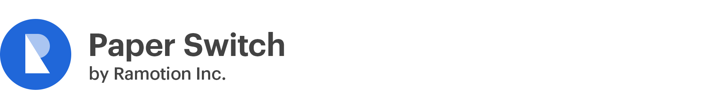

[](https://ramotion.com?utm_source=gthb&utm_medium=special&utm_campaign=paper-switch-logo)

<br><br/>

# RAMPaperSwitch

[](https://cocoapods.org/pods/RAMPaperSwitch)
[](http://cocoapods.org/pods/RAMPaperSwitch)
[](https://cdn.rawgit.com/Ramotion/paper-switch/master/docs/index.html)
[](https://github.com/Ramotion/paper-switch)
[](http://twitter.com/Ramotion)
[](https://travis-ci.org/Ramotion/paper-switch)
[](https://paypal.me/Ramotion)


## About
This project is maintained by Ramotion, Inc.<br>
We specialize in the designing and coding of custom UI for Mobile Apps and Websites.<br>

**Looking for developers for your project?**<br>
This project is maintained by Ramotion, Inc. We specialize in the designing and coding of custom UI for Mobile Apps and Websites.

<a href="mailto:alex.a@ramotion.com?subject=Project%20inquiry%20from%20Github">
</a> <br>

The [iPhone mockup](https://store.ramotion.com/product/iphone-x-clay-mockups?utm_source=gthb&utm_medium=special&utm_campaign=paper-switch) available [here](https://store.ramotion.com?utm_source=gthb&utm_medium=special&utm_campaign=paper-switch).

## Try this UI control in action

<a href="https://itunes.apple.com/app/apple-store/id1182360240?pt=550053&ct=gthb-paper-switch&mt=8" > </a>


## Requirements

- iOS 8.0+
- Xcode 9.0+

# Installation

Just add the `RAMPaperSwitch` folder to your project.

or use [CocoaPods](https://cocoapods.org) with Podfile:
``` ruby
pod 'RAMPaperSwitch' 
```
or [Carthage](https://github.com/Carthage/Carthage) users can simply add to their `Cartfile`:
```
github "Ramotion/paper-switch"
```


# Usage
RAMPaperSwitch is a drop-in replacement of UISwitch. You just need to set the `onTintColor` property of the switch, and it will automatically _paint over_ its superview with the selected color.
You have ability to set duration of animation instead of default value.

1. Create a new UISwitch in your storyboard or nib.

2. Set the class of the UISwitch to RAMPaperSwitch in your Storyboard or nib.

3. Set `onTintColor` for the switch

4. Set `duration` property programmatically if You want to change animation duration.

5. Add animation for other views near the switch if need.


# Animate views
You can animate other views near the switch. For example, you can change color to views or labels that are inside the same superview. Duration of animation can be gotten from the RAMPaperSwitch's property `duration`. You can animate CoreAnimation properties like this:

``` swift
self.paperSwitch.animationDidStartClosure = {(onAnimation: Bool) in
    UIView.transitionWithView(self.label, duration: self.paperSwitch.duration, options: UIViewAnimationOptions.TransitionCrossDissolve, animations: {
        self.label.textColor = onAnimation ? UIColor.whiteColor() : UIColor.blueColor()
    }, completion:nil)
}
```

<br>


This library is a part of a <a href="https://github.com/Ramotion/swift-ui-animation-components-and-libraries"><b>selection of our best UI open-source projects.</b></a>

# Get the Showroom App for iOS to give it a try
Try this UI component and more like this in our iOS app. Contact us if interested.

<a href="https://itunes.apple.com/app/apple-store/id1182360240?pt=550053&ct=paper-switch&mt=8" >
</a>
<a href="mailto:alex.a@ramotion.com?subject=Project%20inquiry%20from%20Github">
</a>
<br>
<br>

Follow us for the latest updates<br>
<a href="https://goo.gl/rPFpid" >
</a>
